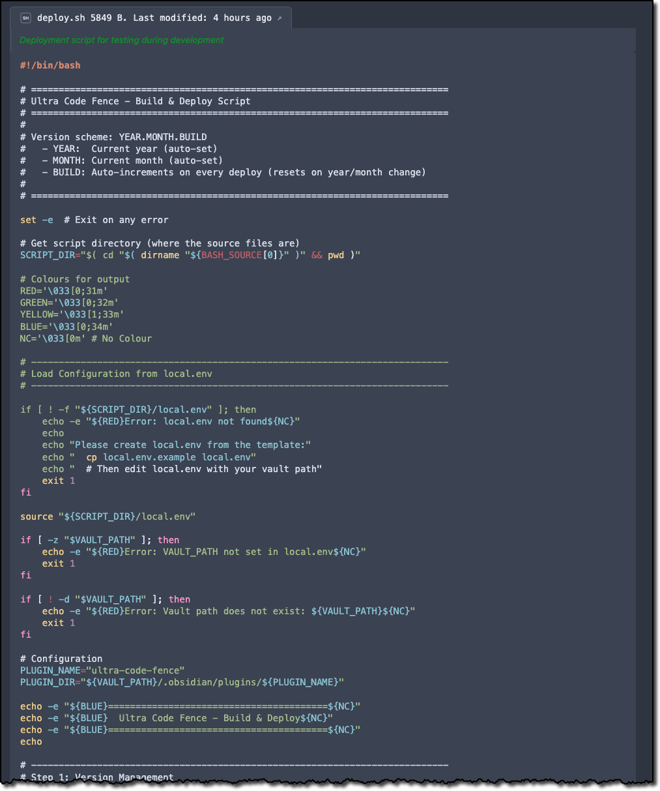
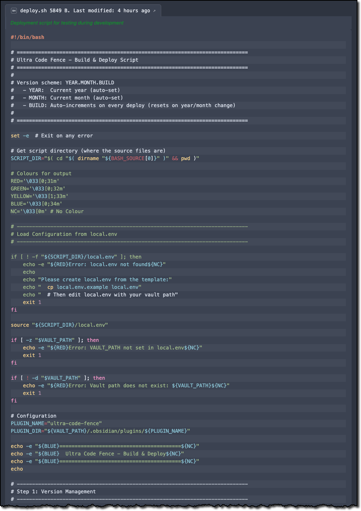
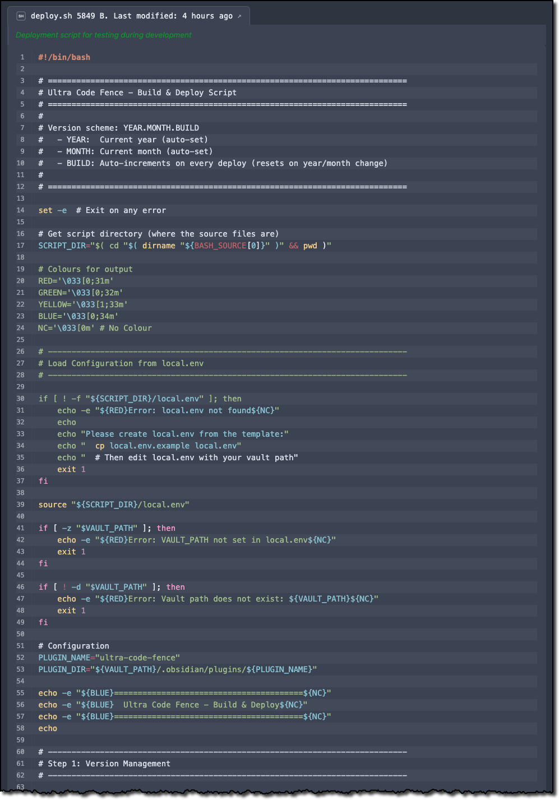
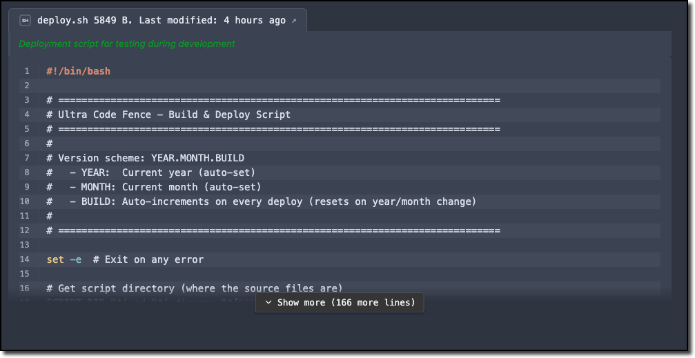
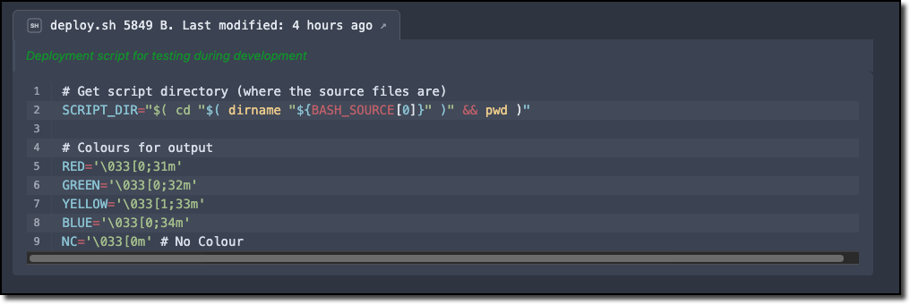
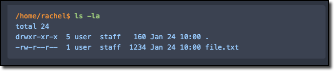

# Demo Renders

## Basic Metadata

    ```ufence-bash
    META:
      PATH: "vault://Assets/Scripts/ultra-code-fence/deploy.sh"
      DESC: "Deployment script for testing during development"
      TITLE: "{filename} {size:bytes}. Last modified: {modified:relative}"
    ```



## Zebra Striping

    ```ufence-bash
    META:
      PATH: "vault://Assets/Scripts/ultra-code-fence/deploy.sh"
      DESC: "Deployment script for testing during development"
      TITLE: "{filename} {size:bytes}. Last modified: {modified:relative}"
    RENDER:
      ZEBRA: true
    ```



## Line Numbers

    ```ufence-bash
    META:
      PATH: "vault://Assets/Scripts/ultra-code-fence/deploy.sh"
      DESC: "Deployment script for testing during development"
      TITLE: "{filename} {size:bytes}. Last modified: {modified:relative}"
    RENDER:
      ZEBRA: true
      LINES: true
    ```



## Code Folding

    ```ufence-bash
    META:
      PATH: "vault://Assets/Scripts/ultra-code-fence/deploy.sh"
      DESC: "Deployment script for testing during development"
      TITLE: "{filename} {size:bytes}. Last modified: {modified:relative}"
    RENDER:
      ZEBRA: true
      LINES: true
      FOLD: 20
    ```



## Filtering

    ```ufence-bash
    META:
      PATH: "vault://Assets/Scripts/ultra-code-fence/deploy.sh"
      DESC: "Deployment script for testing during development"
      TITLE: "{filename} {size:bytes}. Last modified: {modified:relative}"
    RENDER:
      ZEBRA: true
      LINES: true
      FOLD: 20
    FILTER:
      BY_LINES:
        RANGE: 16, 24
    ```



## Command Output

    ```ufence-cmdout
    PROMPT: "^([/~][\\w/.-]*\\$ )(.*)"
    RENDER:
      PROMPT:
        COLOUR: "#ff9933"
        BOLD: false
        ITALIC: false
      COMMAND:
        COLOUR: "#98c379"
        BOLD: true
        ITALIC: false
      OUTPUT:
        COLOUR: "#99ccff"
        BOLD: false
        ITALIC: false
    ~~~
    /home/rachel$ ls -la
    total 24
    drwxr-xr-x  5 user  staff   160 Jan 24 10:00 .
    -rw-r--r--  1 user  staff  1234 Jan 24 10:00 file.txt
    ```


