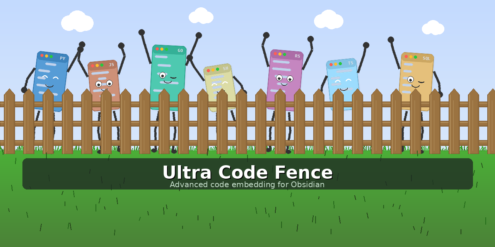

# Ultra Code Fence

[](https://github.com/RachelAmbler/ultra-code-fence/actions/workflows/ci.yml)
[](https://github.com/RachelAmbler/ultra-code-fence/actions/workflows/ci.yml)
[](LICENSE)



Ultra Code Fence extends Obsidian's standard fenced code blocks with advanced embedding, formatting, and display capabilities.

Loosely based on [embed-code-file](https://github.com/almariah/embed-code-file) by Abdullah Almariah.

## Features

- **Flexible code sources** - Embed code directly in your markdown or reference files from anywhere in your vault
- **Space management** - Fold lengthy code blocks or enable scrolling to keep your notes tidy
- **Line numbers and zebra striping** - Add a numbered gutter and alternating line backgrounds for improved readability
- **Multiple title styles** - Display file metadata with customisable title bars in various visual styles
- **Rich descriptions** - Annotate code blocks with descriptions that support full markdown formatting, including links to other vault pages
- **Terminal output formatting** - Style command output with distinct colours and formatting for prompts, commands, and output text
- **Advanced filtering** - Extract specific line ranges or content between markers, with optional chaining

## Installation

### Manual Installation

1. Download the latest release
2. Extract the `ultra-code-fence` folder to your vault's `.obsidian/plugins/` directory
3. Reload Obsidian
4. Enable the plugin in Settings > Community plugins

### From Community Plugins

Search for "Ultra Code Fence" in Settings > Community plugins > Browse.

## Quick Start

Embed a file from your vault:

    ```ufence-python
    META:
      PATH: "vault://scripts/example.py"
    ```

Embed code directly (inline):

    ```ufence-bash
    META:
      TITLE: "Hello World"
    ~~~
    #!/bin/bash
    echo "Hello, World!"
    ```

Use as a drop-in replacement for standard code fences (no YAML needed):

    ```ufence-bash
    #!/bin/bash
    echo "Hello, World!"
    ```

This renders identically to a standard code fence but with Ultra Code Fence features (copy button, line numbers, zebra striping, etc.) applied from your global settings. No title tab is shown unless you explicitly provide one.

## Block Types

### Language-specific blocks

Use `ufence-{lang}` where `{lang}` is any language in your configured list:

- `ufence-python`
- `ufence-bash`
- `ufence-javascript`
- `ufence-typescript`
- `ufence-sql`
- `ufence-java`
- `ufence-cpp`
- `ufence-go`
- `ufence-ruby`
- etc.

### Generic code block

Use `ufence-code` with the `RENDER.LANG` property to specify the language:

    ```ufence-code
    META:
      PATH: "vault://code/example.rs"
    RENDER:
      LANG: "rust"
    ```

### Command output block

Use `ufence-cmdout` to display styled terminal output:

    ```ufence-cmdout
    PROMPT: "^(\\$ )(.*)"
    RENDER:
      PROMPT:
        COLOUR: "#6b7280"
    ~~~
    $ ls -la
    total 24
    drwxr-xr-x  5 user  staff   160 Jan 24 10:00 .
    -rw-r--r--  1 user  staff  1234 Jan 24 10:00 file.txt
    ```

## YAML Configuration Structure

Ultra Code Fence uses a nested YAML structure organised into sections:

```yaml
META:
  PATH: "vault://path/to/file"       # Source file
  TITLE: "{filename} - {size:kb}"    # Title with template variables
  DESC: "Description text"           # Description below title

RENDER:
  FOLD: 0           # 0 = disabled, 1+ = fold to N lines
  SCROLL: 0         # 0 = disabled, 1+ = scroll after N lines
  ZEBRA: false      # Alternating line backgrounds
  LINES: false      # Show line numbers
  COPY: true        # Show copy button
  STYLE: "tab"      # Title bar style
  LANG: "python"    # Language (for ufence-code only)

FILTER:
  BY_LINES:
    RANGE: 10, 50         # Extract lines 10-50
    INCLUSIVE: true       # Include boundary lines (default: true)
  BY_MARKS:
    START: "# BEGIN"      # Start marker
    END: "# END"          # End marker
    INCLUSIVE: true       # Include marker lines (default: true)
```

#### For ufence-cmdout blocks:

```yaml
PROMPT: "^(\\$ )(.*)"     # Top-level regex pattern

RENDER:                   # Styling for cmdout
  PROMPT:
    COLOUR: "#6b7280"
    BOLD: false
    ITALIC: false
  COMMAND:
    COLOUR: "#98c379"
    BOLD: true
    ITALIC: false
  OUTPUT:
    COLOUR: "#abb2bf"
    BOLD: false
    ITALIC: false
```

## META Section

| Property | Type | Description |
|----------|------|-------------|
| `PATH` | string | File path. Use `vault://path/to/file` for vault files or `https://...` for remote URLs |
| `TITLE` | string | Title text. If omitted, no title tab is displayed. Supports template variables |
| `DESC` | string | Description text shown below or as tooltip |

## RENDER Section

| Property | Type | Default | Description |
|----------|------|---------|-------------|
| `FOLD` | number | 0 | 0 = disabled, 1+ = fold to N visible lines. Takes precedence over SCROLL |
| `SCROLL` | number | 0 | 0 = disabled, 1+ = scroll after N lines. Ignored if FOLD is active |
| `ZEBRA` | boolean | false | Alternate line background colours |
| `LINES` | boolean | false | Show line number gutter |
| `COPY` | boolean | true | Show copy button |
| `STYLE` | string | `tab` | Title bar style: `tab`, `integrated`, `minimal`, `infobar`, `none` |
| `LANG` | string | (auto) | Language for syntax highlighting (ufence-code only) |
| `SHIFT_COPY_JOIN` | string | (from settings) | Join operator used when Shift+clicking the copy button |
| `ALT_COPY_JOIN` | string | (from settings) | Join operator used when Alt/Cmd+clicking the copy button. `CMD_COPY_JOIN` is also accepted |
| `JOIN_IGNORE_REGEX` | string | (from settings) | Regex pattern matching lines to strip before joining (e.g., `^\s*#` for shell comments) |

## FILTER Section

The FILTER section allows extracting specific portions of source code. Filters are applied in order: BY_LINES first, then BY_MARKS on the result.

### BY_LINES

| Property | Type | Default | Description |
|----------|------|---------|-------------|
| `RANGE` | string | - | Line range as "start, end" (e.g., "10, 50") |
| `INCLUSIVE` | boolean | true | Include boundary lines in output |

### BY_MARKS

| Property | Type | Default | Description |
|----------|------|---------|-------------|
| `START` | string | - | Start marker string to search for |
| `END` | string | - | End marker string to search for |
| `INCLUSIVE` | boolean | true | Include marker lines in output |

### Filter Chaining Example

```yaml
FILTER:
  BY_LINES:
    RANGE: 10, 100      # First: extract lines 10-100
  BY_MARKS:
    START: "# CONFIG"   # Then: find markers within those lines
    END: "# END CONFIG"
    INCLUSIVE: false    # Exclude the marker lines
```

## Copy with Line Joining

The copy button supports modifier keys for joining lines into a single command, useful when a code block contains sequential terminal commands:

- **Click** — copies the code as-is
- **Shift+click** — joins non-empty lines with the Shift join operator
- **Alt/Cmd+click** — joins non-empty lines with the Alt/Cmd join operator

For example, with Shift join set to `&&`, a block containing:

    apt update
    apt upgrade
    apt autoremove

Shift+click copies as: `apt update && apt upgrade && apt autoremove`

Join operators are configured in Settings (Code tab) per-language. They can also be overridden per-block:

```yaml
RENDER:
  SHIFT_COPY_JOIN: "&&"
  ALT_COPY_JOIN: ";"
```

### Ignoring Lines During Join

Use `JOIN_IGNORE_REGEX` to strip lines matching a regex before joining. This is useful for removing comments from the joined output:

```yaml
RENDER:
  SHIFT_COPY_JOIN: "&&"
  JOIN_IGNORE_REGEX: "^\\s*#"
```

With the above configuration, a block containing:

    # Update packages
    apt update
    # Upgrade everything
    apt upgrade

Shift+click copies as: `apt update && apt upgrade`

The ignore regex can also be set per-language in Settings (Code tab). Per-block YAML overrides the per-language default.

## PROMPT and RENDER Sections (ufence-cmdout only)

For command output blocks, the `PROMPT` property is defined at the top level, and styling is controlled via the nested `RENDER` section.

### PROMPT (top-level)

| Property | Type | Description |
|----------|------|-------------|
| `PROMPT` | string | Regex with two capture groups: `(prompt)(command)` |

### RENDER Section

The `RENDER` section contains three subsections for styling different parts of command output:

| Subsection | Description |
|------------|-------------|
| `PROMPT` | Styling for the prompt text (e.g., `$` or `>>>`) |
| `COMMAND` | Styling for the command text that follows the prompt |
| `OUTPUT` | Styling for output lines (lines not matching the prompt pattern) |

Each subsection supports these properties:

| Property | Type | Default | Description |
|----------|------|---------|-------------|
| `COLOUR` | string | (from settings) | Text colour (CSS colour value) |
| `BOLD` | boolean | false | Bold formatting |
| `ITALIC` | boolean | false | Italic formatting |

### Example Structure

```yaml
PROMPT: "^(\\$ )(.*)"
RENDER:
  PROMPT:
    COLOUR: "#6b7280"
    BOLD: false
    ITALIC: false
  COMMAND:
    COLOUR: "#98c379"
    BOLD: true
    ITALIC: false
  OUTPUT:
    COLOUR: "#abb2bf"
    BOLD: false
    ITALIC: false
```

## Title Template Variables

Use these variables in `META.TITLE` or the default title template setting:

### File Information

| Variable | Example Output | Description |
|----------|---------------|-------------|
| `{filename}` | `script.py` | Full filename with extension |
| `{basename}` | `script` | Filename without extension |
| `{extension}` | `py` | File extension only |
| `{folder}` | `scripts` | Parent folder name |
| `{path}` | `scripts/script.py` | Full path |

### File Size

| Variable | Example Output | Description |
|----------|---------------|-------------|
| `{size}` | `1.5 KB` | Auto-formatted size |
| `{size:auto}` | `1.5 KB` | Same as `{size}` |
| `{size:bytes}` | `1536` | Size in bytes |
| `{size:kb}` | `1.5` | Size in kilobytes |
| `{size:mb}` | `0.0` | Size in megabytes |

### Dates

| Variable | Example Output | Description |
|----------|---------------|-------------|
| `{modified:relative}` | `2 hours ago` | Relative time |
| `{modified:short}` | `1/24/25` | Short date format |
| `{modified:long}` | `January 24, 2025` | Long date format |
| `{modified:iso}` | `2025-01-24T10:30:00` | ISO 8601 format |
| `{created:relative}` | `3 days ago` | File creation date |

### Text Formatting

Append `:upper`, `:lower`, or `:title` to text variables:

| Variable | Example Output |
|----------|---------------|
| `{filename:upper}` | `SCRIPT.PY` |
| `{filename:lower}` | `script.py` |
| `{filename:title}` | `Script.Py` |

## Inline Code

For short code snippets, use the `~~~` separator instead of `META.PATH`:

    ```ufence-python
    META:
      TITLE: "Quick Example"
    ~~~
    def hello():
        print("Hello!")
    ```

Everything before `~~~` is YAML configuration; everything after is code.

## PROMPT Regex Patterns

The `STYLE.PROMPT` property uses a regex with two capture groups to identify command lines:

- Group 1: The prompt (displayed with prompt styling)
- Group 2: The command (displayed with command styling)

Lines that don't match are treated as output.

### Common Patterns

| Pattern | Matches |
|---------|---------|
| `^(\\$ )(.*)` | `$ command` |
| `^(> )(.*)` | `> command` |
| `^(>>> )(.*)` | `>>> command` (Python REPL) |
| `^(.*\\$ )(.*)` | `user@host:~$ command` |
| `^(\\[.*?\\] -> )(.*)` | `[status] -> command` |
| `^(.*@.*:\\S+ \\$ )(.*)` | `user@hostname:/path $ command` |

Note: Backslashes must be doubled in YAML strings.

## Examples

### Basic file embed

    ```ufence-python
    META:
      PATH: "vault://scripts/utils.py"
    ```

### With line filtering

    ```ufence-javascript
    META:
      PATH: "vault://src/app.js"
      TITLE: "Main function"
    FILTER:
      BY_LINES:
        RANGE: 10, 25
    ```

### With marker extraction

    ```ufence-python
    META:
      PATH: "vault://code/example.py"
      TITLE: "Configuration Section"
    FILTER:
      BY_MARKS:
        START: "# BEGIN CONFIG"
        END: "# END CONFIG"
        INCLUSIVE: false
    ```

### Minimal style with line numbers

    ```ufence-bash
    META:
      PATH: "vault://scripts/deploy.sh"
    RENDER:
      STYLE: "minimal"
      LINES: true
    ```

### Folded code block

    ```ufence-sql
    META:
      PATH: "vault://queries/report.sql"
      DESC: "Click to expand full query"
    RENDER:
      FOLD: 5
    ```

### Scrollable code block

    ```ufence-java
    META:
      PATH: "vault://src/Main.java"
    RENDER:
      SCROLL: 15
    ```

### Inline code with all options

    ```ufence-python
    META:
      TITLE: "Quick Sort"
      DESC: "Recursive implementation"
    RENDER:
      STYLE: "infobar"
      LINES: true
      ZEBRA: true
    ~~~
    def quicksort(arr):
        if len(arr) <= 1:
            return arr
        pivot = arr[len(arr) // 2]
        left = [x for x in arr if x < pivot]
        middle = [x for x in arr if x == pivot]
        right = [x for x in arr if x > pivot]
        return quicksort(left) + middle + quicksort(right)
    ```

### Filter chaining: lines then markers

    ```ufence-typescript
    META:
      PATH: "vault://src/config.ts"
      TITLE: "Database Config"
    FILTER:
      BY_LINES:
        RANGE: 50, 200
      BY_MARKS:
        START: "// DATABASE_START"
        END: "// DATABASE_END"
    ```

### Command output with custom styling

    ```ufence-cmdout
    META:
      TITLE: "Deployment Log"
    PROMPT: "^(\\[.*?\\] -> )(.*)"
    RENDER:
      PROMPT:
        COLOUR: "#888888"
      COMMAND:
        COLOUR: "#61afef"
        BOLD: true
    ~~~
    [OK] -> ./deploy.sh
    Deploying to production...
    Done!
    [OK] -> ./verify.sh
    All checks passed.
    ```

### Remote file

    ```ufence-javascript
    META:
      PATH: "https://raw.githubusercontent.com/user/repo/main/index.js"
      TITLE: "Remote Example"
    ```

## Title Styles

### tab (default)

A file tab sitting above the code block, similar to IDE tabs.

### integrated

Full-width header that blends into the code block with no gap.

### minimal

Small, understated, semi-transparent label.

### infobar

Full-width bar with accent border and right-aligned metadata.

### none

No title bar displayed.

## Icon Styles

### emoji

Language-specific emoji icons: Python shows snake, Bash shows scroll, SQL shows filing cabinet, etc.

### text

Short text labels: `PY`, `SH`, `SQL`, `JS`, etc.

### filled

Coloured boxes with language abbreviations.

### outline

Theme-aware outlined boxes with language abbreviations.

### custom

Load icons from a vault folder. Place files named `{language}.svg`, `{language}.png`, etc. in the configured icon folder.

### none

No icons displayed.

## Download Button

Code blocks can include a download button that saves the content to a file. Enable it in Settings (Code tab) with the **Download button** toggle.

On desktop, clicking the button opens a native OS save dialog. Obsidian remembers the last directory used for each note, so subsequent downloads default to the same location. On mobile, the button triggers a standard browser download.

The suggested filename is derived from the title (if set) with the language as the extension. For example, a block with `TITLE: "deploy"` in `ufence-bash` suggests `deploy.bash`. If no title is provided, the default is `code.{lang}`.

## Presets & Page Defaults

Presets let you define reusable YAML configurations that can be referenced by name across multiple code blocks.

### Creating a preset

Open Settings → Ultra Code Fence → **Presets** tab. Give your preset a name and enter the YAML config it should contain (using the same `RENDER:`, `META:`, `FILTER:` structure as a regular block).

### Using a preset in a block

Reference a preset by name under `META.PRESET`:

```yaml
META:
  PRESET: "teaching"
  TITLE: "My Override Title"
RENDER:
  ZEBRA: false
```

Block-level properties always take priority over preset values, so you can override individual settings as needed.

### Page-level defaults with ufence-ufence

You can set defaults for every ufence block on a page by adding an invisible `ufence-ufence` config block:

````
```ufence-ufence
RENDER:
  ZEBRA: true
  LINES: true
```
````

The block is hidden in the rendered view. All ufence blocks on the same page inherit these defaults (unless they override them individually). Only one `ufence-ufence` block is supported per page.

You can also reference a named preset at page level:

````
```ufence-ufence
PRESET: "teaching"
```
````

### Refreshing after changes

Changes to a `ufence-ufence` block or to a saved preset do **not** update existing code blocks automatically. To see your changes, use the **Force Refresh** command:

**Command palette** → *Ultra Code Fence: Force refresh all code blocks*

You can assign a hotkey to this command in Settings → Hotkeys for quicker access. Preset changes made via the Settings UI apply automatically when you click **Save**.

## Keyboard Shortcuts

- **Click title**: Open source file (vault files open in Obsidian; URLs open in browser)
- **Ctrl/Cmd + Click title**: Open vault file in new pane
- **Click copy button**: Copy code to clipboard
- **Click download button**: Save code to file
- **Click fold button**: Expand/collapse code block

## CSS Classes

For custom styling, the plugin uses these CSS class prefixes:

- `.ucf` - Main container
- `.ucf-title` - Title bar
- `.ucf-code` - Code block
- `.ucf-line` - Individual lines
- `.ucf-cmdout-*` - Command output elements

## Licence

MIT

## Credits

- Original [embed-code-file](https://github.com/almariah/embed-code-file) plugin by Abdullah Almariah
- Modernised and extended by Rachel Ambler

## Demo Screenshots

See [Demos.md](Demos.md) for visual examples of the plugin's features.